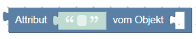
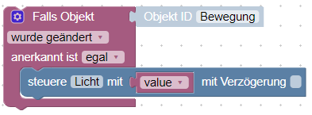

# System

## Debug

Schreibt den frei wählbaren Text, hier `test` ins log und dient zum debuggen
eines Scripts wie dies:

Dieses Beispiel zum importieren: 

Es können 4 verschiedene Level für die Nachrichten definiert werden:

- _debug_

dazu muss der debug-Level der JavaScript Instanz aktiviert sein.

- _info_

default, zumindest der info log level muss in der JavaScript Instanz aktiviert
sein.

- _warning_

fehlt

- _error_

wird immer angezeigt. Die anderen Level können ignoriert werden, wenn
es entsprechend in  der JavaScript Instanz eingestellt ist.

## Kommentar

Dieser Block dient ausschließlich dazu einen Kommentar für z.B.
Erklärungen einzelner Funktionen zum Skript hinzuzufügen.

> Tipp: Pro Kommentar Block sind max. 48 Zeichen zulässig. Für längere Texte
> deswegen mehrere Kommentar Blöcke verwenden

## Steuere Zustand

Steuert den Zustand eines Objektes mit dem gewünschten Status

Typische Anwendung:

Die Object ID wird durch Klick ausgewählt. Abhängig vom Datenpunkt kann der Wert
vom Typ [string](#string-value), [number](#number-value) oder [boolean](#ogical-value-trueflase) sein.

Weitere Erklärungen sind [hier](https://github.com/ioBroker/ioBroker/wiki/Adapter-Development-Documentation#commands-and-statuses) in Englisch zu finden.

Dieser Block schreibt den Befehl in den Datenpunkt mit (ack=false). Zusätzlich
kann eine Verzögerung mit klicken auf die Checkbox eingeschaltet werden. Bei
einer Verzögerung ungleich 0, wird der Zustand nicht sofort, sondern erst nach
dem angegebenen Wert in Millisekunden, Sekunden oder Minuten gesetzt.

Es können weitere eventuell vorhandene Verzögerungen für diesen Datenpunkt
gelöscht werden, indem die Checkbox `löschen falls läuft` angeklickt wird.

Im folgenden Beispiel wird der Datenpunkt `Licht` nur __einmal__ nach 2 Sekunden
geschaltet:

Dieses Beispiel zum importieren: 

Hier wird der Zustand von `Licht` zwei mal nach 1 Sekunde __und__ nach 2 Sekunden
geschaltet:

Dieses Beispiel zum importieren: 

## Zustand umschalten

Dieser Block schaltet zwischen den Werten um, von true nach false und umgekehrt.

## Aktualisiere Zustand

Dieser Block aktualisiert einen Wert. Es wird kein Befehl zum steuern von Hardware
gesendet.

Typische Anwendung:

## Binde zwei Zustände

Dieser Block bindet zwei Zustände miteinander. 
Über `nur Änderungen` kann ausgewählt werden, ob der Wert nur weitergeleitet
wird, wenn sich die Quelle ändert, oder mit jeder Aktualisierung.

Diese Blöcke:

entsprechend mit dem Binde Block:

Dieses Beispiel zum importieren: 

## Schreibe Zustand

Block, der [Aktualisiere Zustand](#aktualisiere-zustand) und [Steuere Zustand](#steuere-zustand) zusammen ausführt.
Object ID und Verzögerung mit anderen Bausteinen kann aber definiert werden.

## Datenpunkt erzeugen

Dieser Block erzeugt globale Datenpunkte. Wenn dieser bereits existiert wird der
Befehl ignoriert, somit kann dieser Block ohne Gefahr immer im Skript bleiben.

In javascript können Variablen/Datenpunkte in Skripten auf zwei Arten genutzt
werden:

- lokal [variablen](#set-variables-value)
- global

Globale Datenpunkte sind in allen Skripten nutzbar, Lokale hingegen nur im
Skript in denen sie angelegt wurden.

Globale Datenpunkte können in vis und allen anderen Visualisierungsmodulen
genutzt werden und können in Datenbanken geloggt werden.

Typische Anwendung:

Dieses Beispiel zum importieren: 

Der neu erzeugte Datenpunkt kann direkt in dem Blockly selbst genutzt werden.

> Bei der ersten Ausführung des Skripts mit einem solchen Blockly wird ein Fehler
> ausgegeben, da der Datenpunkt erst nach der Ausführung des Skripts erzeugt wird.
> Bei der zweiten Ausführung wird kein Fehler mehr ausgegeben, da der Datenpunkt
> jetzt existiert.

## Wert eines Datenpunktes nach ID

Dieser Block dient dazu den Inhalt eines Datenpunktes auszulesen. Folgende Attribute
des Datenpunktes können ausgelesen werden:

- _Wert_

true, false oder Wert des Datenpunktes

- _Anerkannt_

Befehl = falsch oder update = wahr

- _Zeitstempel_

in ms seit dem 01.01.1970 (Typ "Datumsobjekt")

- _Letzte Änderung_

des Wertes in ms seit dem 01.01.1970 (Typ "Datumsobjekt")

- _Qualität_

???

- _Quelle_

Name der Instanz, die den letzten Wert geschrieben hat, wie z.B.
"system.adapter.javascript.0"

Beispiel um die Zeit der letzten Änderung des Wertes auszugeben:

Dieses Beispiel zum importieren: 

## Wert eines Datenpunktes nach Namen

Beschreibung fehlt noch!

## Wert eines Datenpunktes nach ID und Funktion

Beschreibung fehlt noch!

## Objekt ID

Hilfsblock um komfortabel die Objekt ID zum triggern eines Blocklys zu wählen.
Der ID Auswahldialog wird durch Anklicken von "Objekt ID" geöffnet.

Typische Anwendung:

Dieses Beispiel zum importieren: 

## Attribut

Gibt ein Attribut des Objekts zurück. Der Pfad zum Attribut kann wie im Beispiel
verschachtelt sein.

Wenn das erste Attribut string ist, versucht die Funktion, den String als JSON-
String zu analysieren.
