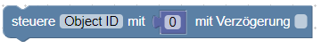
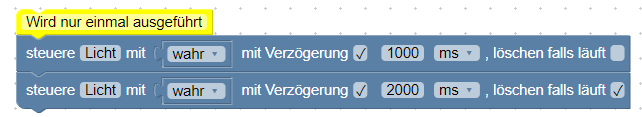

!> Achtung, Seite befindet sich noch im Aufbau

# Inhaltsverzeichnis

* [Beschreibung](#beschreibung)
* [Editorfenster](#editorfenster)
* [Blöcke im einzelnen](#blöcke-im-einzelnen)
	* [System](#system)

        [](#debug)

		[](#kommentar)

		[](#steuere-zustand)

		[](#zustand-umschalten)

		[](#aktualisiere-zustand)

		[](#binde-zwei-zustände)

		[](#schreibe-zustand)

		[](#datenpunkt-erzeugen)

		[](#wert-eines-datenpunktes-nach-id)

		[](#wert-eines-datenpunktes-nach-namen)

		[](#wert-eines-datenpunktes-nach-id-und-funktion)

		[](#objekt-id)

		[](#attribut)

	* [Aktionen](#aktionen)

		[](#systembefehl-ausführen)

		[](#url-abfragen)

	* [SendTo](#sendto)

		[](#an-telegram-etwas-senden)

		[](#über-sayit-text-aussprechen)

		[](#an-pushover-etwas-senden)

		[](#email-versenden)

		[](#einem-adapter-etwas-senden)

        [](#etwas-an-ifttt-senden)

	* [Datum und Zeit](#datum-und-zeit)

		[](#zeit-vergleichen)

		[](#vergleich-mit-aktueller-uhrzeit)

		[](#aktuelle-zeit-in-einem-bestimmten-format-abrufen)

		[](#zeit-für-aktuelle-astro-events-abrufen)

	* [Konvertierung](#konvertierung)

		[](#[nach-Zahl-konvertieren)

		[](#nach-logikwert-konvertieren)

		[](#nach-string-konvertieren)

		[](#variablentyp-abrufen)

		[](#nachdatum-zeit-konvertieren)

		[](#datum-zeit-objekt-nach-string-konvertieren)

		[](#json-nach-objekt-konvertieren)

		[](#objekt-nach-json-konvertieren)

	* [Trigger](#trigger)

		[](#trigger-bei-mehreren-zustandswechseln)

		[](#trigger-bei-einem-zustandswechsel)

		[](#trigger-info)

		[](#zeitplan)

		[](#trigger-auf-astro-ereignis)

		[](#benannter-zeitplan)

		[](#lösche-benannten-zeitplan)

		[](#cron-mit-dialog)

		[](#cron-regel-mit-dialog)

	* [Timeouts](#timeouts)

		[](#ausführung-verzögern)

		[](#verzögerte-ausführung-beenden)

		[](#interval-ausführen)

		[](#ausgeführtes-interval-beenden)

	* [Logik](#logik)

		[](#if-else-block)

		[](#comparision-block)

		[](#logical-and-or-block)

		[](#negation-block)

		[](#logical-value-true-false)

		[](#null-block)

		[](#test-block)

	* [Schleifen](#schleifen)

		[](#repeat-n-times)

		[](#repeat-while)

		[](#count)

		[![For each]

		[](#break-out-of-loop)

	* [Mathematik](#mathematik)

		[](#number-value)

		[](#arithmetical-operations)

		[](#square-root-abs---ln-log10-e-10)

		[](#sin-cos-tan-asin-acos-atan)

		[](#math)

		[](#is-even-odd-)

		[](#modify-variably-by-value-plus-or-minus)

		[](#round-floor-ceil-value)

		[![Runden mit angabe der Nachkommastelle]

		[![Wert aus Liste berechnen]

		[![Rest nach Division (Modulus)]

		[](#limit-some-value-by-min-and-max)

		[](#random-value-between-min-and-max)

		[](#random-value-from-0-to-1)

	* [Text](#text)

		[](#string-value)

		[](#zeilenumbruch)

		[](#concatenate-strings)

		[](#append-string-to-variable)

		[](#length-of-string)

		[](#is-string-empty)

		[](#find-position-in-string)

		[](#get-symbol-string-specific-position)

		[](#get-substring)

		[](#Convert-to-upper-case-or-to-lower-case)

		[](#trim-string)

	*  [Listen](#listen)

		[](#create-empty-list)

		[](#create-list-with-values)

		[](#create-list-with-same-value-n-times)

		[](#get-length-of-list)

		[](#is-list-empty)

		[](#Find-position-of-item-in-list)

		[](#get-item-in-list)

        [](#set-item-in-list)

		[](#get-sublist-of-list)

		[](#convert-text-to-list-and-vice-versa)

		[![Liste sortieren]

	* [Farbe](#farbe)

		[](#colour-value)

		[](#random-colour)

		[](#rgb-colour)

		[](#mix-colours)

	* [Variablen](#variablen)

		[](#set-variables-value)

		[](#get-variables-value)

		[](#addiere-zur-variablen)

	* [Funktionen](#funktionen)

		[](#create-function-from-blocks-with-no-return-value)

		[](#create-function-from-blocks-with-return-value)

		[](#return-value-in-function)

		[](#create-custom-function-with-no-return-value)

		[](#create-custom-function-with-return-value)

		[](#call-function)


# Beschreibung
Blockly ist eine JavaScript-Bibliothek, die einen visuellen Code-Editor anbietet.
Auch ohne Kenntnis einer Programmiersprache ist die Bedienung der grafischen
Blöcke einfach zu erlernen.
Der Blockly-Editor im ioBroker JavaScript-Adapter erlaubt es, Skripte durch
zusammenfügen von grafisch Blöcken per Drag & Drop zu erstellen.


## Editorfenster
Aufruf des Editors erfolgt bei installiertem JavaScript-Adapter im Admin Fenster
Links unter Skripte.

> Falls Skripte nicht sichtbar ist und der JavaScript-Adapter aber installiert
ist, muss über das Dreieck oben links im Admin Fenster der Haken bei
Skripte gesetzt werden.

Beim ersten Start sind die Ordner *global* und *common* bereits angelegt.

> Der Ordner *global* ist nur für Skripte aus reinem JavaScript vorgesehen.
Mit Blockly erstellte Skripte dürfen dort auf __keinen__ Fall abgespeichert
und gestartet werden.

> __Vorsicht:__
Skripte im Ordner _global_ werden zu ___jedem___ Skript als Kopie hinzugefügt
und somit immer mit ausgeführt.

> Der Ordner *global* ist nur bei eingeschalteten Expertenmodus sichtbar.

Die Ordnerstruktur kann nach eigenem Wunsch angelegt werden. Der Speicher-
ort hat keine Auswirkungen auf die Funktionalität eines Skriptes.

Ein Suchfeld erleichtert das Wiederfinden von Skripten.

Damit ein Skript läuft, muss es links in der Ordnerstruktur durch klick auf den
roten Play Knopf aktiviert werden. Zum Stoppen auf den grünen Pause-Knopf
drücken.
Für jedes Skript wird ein neues Objekt angelegt. Es trägt den Skriptnamen mit
dem Zusatz `_enabled` und liegt im Ordner `javascript.0.ScriptEnabled`.
Das Objekt zeigt mit `true/false` an, ob das Skript läuft. Der Zustand kann auch
gesetzt werden, um ein Skript ein-/auszuschalten.
Im Fenster links ist die Symbolleiste und die Ordner- und Dateileiste zu finden.
Rechts das Editor Fenster mit Block-Sidebar und Arbeitsfläche und unten das
Log-Fenster.


Gewünschte Blöcke werden über die verschiedenen [Kategorien](#verfügbare-blöcke) ausgewählt und
per Drag and Drop auf der Arbeitsfläche abgelegt.

Werte oder Inhalte der Blöcke werden über Dropdown Menü oder über Maus
Linksklick geändert.

Mit Maus Rechtsklick über einem Block im Entwurfsfenster werden zusätzliche
Befehle verfügbar:


- _Kopieren:_

Kopiert einen Block (und mit ihm verbundene Blöcke) und fügt ihn direkt ein.

- _Kommentar hinzufügen:_

Für jeden Block ist es möglich einen Kommentar zu hinterlegen um dessen Funktion
zu beschreiben.

- _interne Eingänge:_

Ändert Ansicht eines Blocks für eine bessere Übersicht.

- _Baustein zusammenfalten:_

um eine bessere Übersicht zu erhalten können Bausteine,zusammengefaltet werden.

- _Baustein deaktivieren:_

Deaktiviert einzelne Blöcke.

- _x Bausteine löschen:_

Löscht einen Block bzw. alle verbundenen Blöcke.

- _Hilfe:_

Ruft die dem Block zugeordnete ioBroker Dokumentation auf. (in Arbeit)


## Blöcke im einzelnen

Blöcke sind im JavaScript-Adapter in Kategorien in folgender Reihenfolge angeordnet:

* [System](#system)
* [Aktionen](#aktionen)
* [Sendto](#sendto)
* [Datum und Zeit](#datum-und-zeit)
* [Konvertrierung](#konvertierung)
* [Trigger](#trigger)
* [Timeouts](#timeouts)
* [Logik](#logik)
* [Schleifen](#schleifen)
* [Mathematik](#mathematik)
* [Text](#text)
* [Listen](#listen)
* [Farbe](#farbe)
* [Variablen](#variablen)
* [Funktionen](#funktionen)


## System


### Debug


Schreibt den frei wählbaren Text, hier `test` ins log und dient zum debuggen
eines Scripts wie dies:


Dieses Beispiel zum importieren: 

Es können 4 verschiedene Level für die Nachrichten definiert werden:

- _debug_

dazu muss der debug-Level der JavaScript Instanz aktiviert sein.

- _info_

default, zumindest der info log level muss in der JavaScript Instanz aktiviert
sein.

- _warning_

fehlt

- _error_

wird immer angezeigt. Die anderen Level können ignoriert werden, wenn
es entsprechend in  der JavaScript Instanz eingestellt ist.


### Kommentar


Dieser Block dient ausschließlich dazu einen Kommentar für z.B.
Erklärungen einzelner Funktionen zum Skript hinzuzufügen.

> Tipp: Pro Kommentar Block sind max. 48 Zeichen zulässig. Für längere Texte
> deswegen mehrere Kommentar Blöcke verwenden 


### Steuere Zustand


Steuert den Zustand eines Objektes mit dem gewünschten Status

Typische Anwendung:



Die Object ID wird durch Klick ausgewählt. Abhängig vom Datenpunkt kann der Wert
vom Typ [string](#string-value), [number](#number-value) oder [boolean](#ogical-value-trueflase) sein.

Weitere Erklärungen sind [hier](https://github.com/ioBroker/ioBroker/wiki/Adapter-Development-Documentation#commands-and-statuses) in Englisch zu finden.

Dieser Block schreibt den Befehl in den Datenpunkt mit (ack=false). Zusätzlich
kann eine Verzögerung mit klicken auf die Checkbox eingeschaltet werden. Bei
einer Verzögerung ungleich 0, wird der Zustand nicht sofort, sondern erst nach
dem angegebenen Wert in Millisekunden, Sekunden oder Minuten gesetzt.

Es können weitere eventuell vorhandene Verzögerungen für diesen Datenpunkt
gelöscht werden, indem die Checkbox `löschen falls läuft` angeklickt wird.

Im folgenden Beispiel wird der Datenpunkt `Licht` nur __einmal__ nach 2 Sekunden
geschaltet:



Dieses Beispiel zum importieren: 

Hier wird der Zustand von `Licht` zwei mal nach 1 Sekunde __und__ nach 2 Sekunden
geschaltet:


Dieses Beispiel zum importieren: 


### Zustand umschalten


Dieser Block schaltet zwischen den Werten um, von true nach false und umgekehrt.


### Aktualisiere Zustand


Dieser Block aktualisiert einen Wert. Es wird kein Befehl zum steuern von Hardware
gesendet.

Typische Anwendung:


### Binde zwei Zustände


Dieser Block bindet zwei Zustände miteinander. 
Über `nur Änderungen` kann ausgewählt werden, ob der Wert nur weitergeleitet
wird, wenn sich die Quelle ändert, oder mit jeder Aktualisierung.

Diese Blöcke:


entsprechend mit dem Binde Block:


Dieses Beispiel zum importieren: 


### Schreibe Zustand


Block, der [Aktualisiere Zustand](#aktualisiere-zustand) und [Steuere Zustand](#steuere-zustand) zusammen ausführt.
Object ID und Verzögerung mit anderen Bausteinen kann aber definiert werden.


### Datenpunkt erzeugen


Dieser Block erzeugt globale Datenpunkte. Wenn dieser bereits existiert wird der
Befehl ignoriert, somit kann dieser Block ohne Gefahr immer im Skript bleiben.

In javascript können Variablen/Datenpunkte in Skripten auf zwei Arten genutzt
werden:

- lokal [variablen](#set-variables-value)
- global

Globale Datenpunkte sind in allen Skripten nutzbar, Lokale hingegen nur im
Skript in denen sie angelegt wurden.

Globale Datenpunkte können in vis und allen anderen Visualisierungsmodulen
genutzt werden und können in Datenbanken geloggt werden.

Typische Anwendung:


Dieses Beispiel zum importieren: 

Man kann den neu erzeugten Datenpunkt direkt in dem Blockly selber nutzen.

> Bei der ersten Ausführung des Skripts mit einem solchen Blocklys wird ein Fehler
> ausgegeben, da der Datenpunkt erst nach der Ausführung des Skripts erzeugt wird.
> Bei der zweiten Ausführung wird kein Fehler mehr ausgegeben, da der Datenpunkt
> jetzt existiert.


### Wert eines Datenpunktes nach ID


Dieser Block dient dazu den Inhalt eines Datenpunktes auszulesen. Folgende Attribute
des Datenpunktes können ausgelesen werden:

- _Wert_

true, false oder Wert des Datenpunktes

- _Anerkannt_

Befehl = falsch oder update = wahr

- _Zeitstempel_

in ms seit dem 01.01.1970 (Typ "Datumsobjekt")

- _Letzte Änderung_

des Wertes in ms seit dem 01.01.1970 (Typ "Datumsobjekt")

- _Qualität_

???

- _Quelle_

Name der Instanz, die den letzten Wert geschrieben hat, wie z.B.
"system.adapter.javascript.0"

Beispiel um die Zeit der letzten Änderung des Wertes auszugeben:


Dieses Beispiel zum importieren: 


### Wert eines Datenpunktes nach Namen


Beschreibung fehlt noch!


### Wert eines Datenpunktes nach ID und Funktion


Beschreibung fehlt noch!


### Objekt ID


Hilfsblock um komfortabel die Objekt ID zum triggern eines Blocklys zu wählen.
Der ID Auswahldialog wird durch Anklicken von "Objekt ID" geöffnet.

Typische Anwendung:


Dieses Beispiel zum importieren: 


### Attribut


Gibt ein Attribut des Objekts zurück. Der Pfad zum Attribut kann wie im Beispiel
verschachtelt sein.

Wenn das erste Attribut string ist, versucht die Funktion, den String als JSON-
String zu analysieren.


## Aktionen

### Systembefehl ausführen


Dieser Block führt das eingegebene Kommando im System so aus, als ob es in
der SSH Konsole eingegeben wurde.

> Der Befehl wird mit den Userrechten ausgeführt mit dem ioBroker gestartet wurde.

Ohne Ergebnissausgabe:


Wenn eine Ausgabe erfolgen soll, den Haken bei `mit Ergebnissen` setzen:


Dieses Beispiel zum importieren: 


Zur Analyse der Ausgabe werden 3 besondere Variablen erzeugt:

- _Ergebnis_

enthält die reguläre Ausgabe auf die Konsole (z.B für den Befehl "ls /opt/"
lautet die Ausgabe "iobroker nodejs")

- _Fehlerobjekt_

wenn der Befehl vom JavaScript Modul nicht ausgeführt werden konnte

- _stderr_

die Fehlerausgabe des ausgeführten Programms


Zusätzlich wird die selbe Ausgabe auch im log erscheinen, wenn der loglevel
nicht auf 'none' steht.


### URL abfragen


Ruft eine URL auf und gibt das Ergebnis zurück.

Beispiel:


Zur Anlayse der Ausgabe werden 3 besondere Variable erzeugt:

- _Ergebnis_

enthält den body der angeforderten Seite
- _Fehler_

enthält eine Fehlerbeschreibung
- _Antwort_

(nur für Fortgeschrittene), Spezialobjekt vom Typ [http.IncomingMessage](https://nodejs.org/api/http.html#http_class_http_incomingmessage)

Wenn keine Ausgabe gewünscht ist, kann diese unterdrückt werden. Dazu die Option
"mit Ergebnis" abhaken.


## SendTo
>Die SendTo Blöcke für telegram, Sayit, pushover und email erscheinen erst nachdem
der entsprechende Adapter installiert und konfiguriert wurde.


### An telegram etwas senden


Dieser Block dient dazu eine Nachricht über telegram mit Hilfe des telegram-
Adapters zu senden.

Über Dropdown kann ausgewählt werden ob die Nachricht entweder über alle
verfügbaren Instanzen oder nur über eine Instanz (üblicherweise telegram.0)
gesendet werden soll.

Das Feld `Meldung` beinhaltet den zu sendenden Text und ist zwingend Notwendig.

> Texte können auch aus Textblöcken erstellt werden

Empfänger Angabe  ist optional. Dies ist die ID von [telegram](https://core.telegram.org/bots/api#user) (Eindeutige Kennung für
user oder bot).

Bei Loglevel ungleich `keins` wird die gesendete Nachricht auch im Log Fenster
ausgegeben.


### Über SayIt Text aussprechen


Dieser Block wird verwendet, um Text an eine SayIt-Instanz zu senden und diesen
Text auszusprechen.

Über Dropdown kann ausgewählt werden ob die Nachricht entweder über alle
verfügbaren Instanzen oder nur über eine Instanz (üblicherweise sayit.0) gesendet
werden soll.

Das Feld `Meldung` beinhaltet den zu sendenden Text und ist zwingend Notwendig.

Die Spracheinstellungen der text2speech engine müssen geprüft werden.

Die Angabe der Lautstärke in Werten von 0 bis 100 ist optional.

Bei Loglevel ungleich `keins` wird die gesendete Nachricht auch im Log Fenster
ausgegeben.


### An pushover etwas senden


Dieser Block sendet Text an einen pushover-Client. [Infos](https://github.com/ioBroker/ioBroker.pushover) zum pushover Adapter.

Um eine Nachricht an eine bestimmte Instanz zu senden, muss die installierte
Adapterinstanz (normalerweise pushover.0) ausgewählt werden. Andernfalls 
wird eine Nachricht an alle vorhandenen Instanzen gesendet.

Eigenschaft * Nachricht * ist obligatorisch und genau dieser Text wird an den Kunden gesendet.

Alle anderen Eigenschaften sind optional und können [hier](https://pushover.net/api) nachgelesen werden.

- *device ID*

Gerätename an den eine Nachricht gesendet werden soll (mehrere Geräte können mit  Komma getrennt eingegeben werden).
- *title*

Titel der Nachricht, andernfalls wird der Name der App verwendet 
- *URL*

eine zusätzliche URL, die mit der Nachricht gesendet wird
- *URL title*

Titel für die zusätzliche URL, ansonsten wird nur die URL angezeigt 
- *priority*  

-2 für keine Benachrichtigung/Warnung zu generieren
-1 um immer eine stille Benachrichtigung zu senden,
1 um sie mit hoher Priorität anzuzeigen und die Ruhezeit des Benutzers zu umgehen,
2 um eine Benutzerbestätigung anzufordern 
- *time in ms*

ein Unix-Zeitstempel von Datum und Uhrzeit, die dem Benutzer angezeigt werden soll, anstatt der Uhrzeit, zu der die Nachricht von der API empfangen wird 
- *sound*

Der Name eines der von Geräteclients unterstützten Sounds, um die Standard-Soundauswahl des Benutzers zu überschreiben 

Bei Loglevel ungleich `keins` wird die gesendete Nachricht auch im Log Fenster
ausgegeben.


### email versenden


This block is used to send text as email.

Of course the email adapter must be installed, configured and tested.

To send message to some specific instance, you should select the installed adapter instance (Normally email.0), elsewise message will be sent to all existing instances.

Property *text* is mandatory and exactly this text will be sent to client.

Of course the destination (*to*) must be filled with valid email address.

You can attach up to files (normally images) to email. To use images in the text, you must change format to HTML (check "Send as HTML" option) and text could look like:

```html
<p>Embedded image 1: </p>
<p>Embedded image 2: </p>
```

You can refer to files as ``````. "file1" and "file2" are reserved IDs and cannot be changed.

"file name" must consist full path to image on disk.

[Send to email](img/03sendto/_email_1_en.PNG)

Bei Loglevel ungleich `keins` wird die gesendete Nachricht auch im Log Fenster
ausgegeben.


### Einem Adapter etwas senden
[Custom sendTo block](img/03sendto/_custom_en.PNG)

This is just a help block to send internal system message (sendTo) to any adapter.

Of course you can use custom function block to do anything crazy, and to send messages too.

You can define your own parameters for sendTo command:

[Custom sendTo block](img/03sendto/_custom_1_en.PNG)

Read more [here](https://github.com/ioBroker/ioBroker.javascript#sendto) about "sendTo".

Example how to send SQL query to sql adapter:

[Custom sendTo block](img/03sendto/_custom_2_en.PNG)


If you will use only one parameter with empty name, so no structure will created, like here:

```javascript
var obj, result;

/**
 * Describe this function...
 */
function JSON_stringify(obj) {
    return JSON.stringify(obj);
}


// Send query to SQL adapter
sendTo("sql.0", "query", 'SELECT * FROM datapoints', function (result) {
    console.log((JSON_stringify(result)));
  });
console.log("sql.0: " + "");
```

Or how to request history from SQL adapter:

[Custom sendTo block](img/03sendto/_custom_3_en.PNG)


Generated JavaScript code:
```javascript
var obj, end, result;

/**
 * JSON.stringify object
 */
function JSON_stringify(obj) {
    return JSON.stringify(obj);
}


// Get history from SQL adapter
end = (new Date().getTime());
sendTo("sql.0", "getHistory", {
   "id": 'system.adapter.admin.0.memRss',
   "options": {start: end - 3600000, end: end, aggregate: "minmax"}
}, function (result) {
    console.log((JSON_stringify(result)));
  });
```

If you will start value with "{" it will be interpreted as JSON string. Use double quotes in string.


### Etwas an IFTTT senden


## Datum und Zeit

### Zeiten vergleichen


Falls über Dropdown `zwischen` oder `nicht zwischen` ausgewählt wird, ändert sich der
Block folgendermaßen:


Folgende Vergleiche möglich:

- aktuelle Zeit ist kleiner als eingegebene Zeit
- aktuelle Zeit ist gleich oder kleiner als eingegebene Zeit
- aktuelle Zeit ist größer als eingegebene Zeit
- aktuelle Zeit ist gleich oder größer als eingegebene Zeit
- aktuelle Zeit ist gleich mit eingegebener Zeit
- aktuelle Zeit ist zwischen eingegebenen Zeiten
Es wird geprüft ob die aktuelle Zeit größer oder gleich als die erst genannte Zeit
(Startzeit) ist _und_ kleiner als die zweit genannte Zeit (Endzeit) ist.

- aktuelle Zeit ist nicht zwischen eingegebenen Zeiten
Es wird geprüft ob die aktuelle Zeit kleiner als die erst genannt Zeit (Startzeit) ist
  _und_ größer oder gleich als die zweit genannte Zeit (Endzeit) ist.

Durch abwählen des Hakens ist es möglich auch andere Zeitformate mit Datumsobjekten
zu vergleichen:


Folgende Zeitformate sind gültig:

- JJJJ-MM-TT SS:MM:ss
- JJJJ-MM-TT SS:MM
- SS:MM:ss
- SS:MM


### Vergleich mit aktueller Uhrzeit


Auch dieser Block wird verwendet, um die Tageszeit mit der aktuellen Zeit zu vergleichen.
Die Logik entspricht [Zeiten vergleichen](#time-comparision), es können aber keine Datumsobjekte eingefügt
werden und der Vergleich ist immer mit der aktuellen Zeit.


### Aktuelle Uhrzeit in einem bestimmten Format abrufen


Folgende Formate sind möglich auszugeben:

- Datum-Objekt - Epoch Zeit in Millisekunden bezogen auf GMT
(1970.1.1 00:00:00.000Z GMT).
- Millisekunden - der aktuellen Sekunde von 0 bis 999,
- Sekunden - der aktuellen Minute von 0 bis 59,
- Sekunden seit Tagesanfang - Anzahl der Sekunden seit Tagesbeginn (0 bis 24 * 3600 - 1),
- Minuten - der aktuellen Stunde von 0 bis 59 aus,
- Minuten seit Tagesanfang - Anzahl der Minuten seit Tagesbeginn (0 bis 24 * 60 - 1),
- Stunden - des aktuellen Tages von 0 bis 23,
- Monatsdatum - Tag des Monats von 1 bis 31,
- Monat als Nummer - aktueller Monat als Zahl von 1 bis 12 ,
- Monat als Text - aktueller Monat als Text mit Sprachauswahl.
- Monat als Kurztext - aktuellen Monat als Kurztext mit Sprachauswahl:
Jan, Feb,  Mar,  Apr, Mai, Juni, Juli, Aug, Sept, Okt, Nov, Dez.
- Jahr, kurz - aktuelles Jahr von 0 bis 99, z.B.: 2018 ergibt 18.
- Jahr, voll - aktuelles Jahr
- Wochentag als Text - der aktuelle Wochentag in Textform mit Sprachauswahl.
- Wochentag als Kurztext - der aktuelle Wochentag in Kurzform mit Sprachauswahl:
So, Mo, Di, Mi, Do, Fr, Sa.
- Wochentag als Nummer - der aktuelle Wochentag von 1 (Montag) bis 7 (Sonntag).
- anwenderformatiert - Eigene Formate verwenden
- JJJJ.MM.TT - 2016.09.14
- JJJJ/MM/TT - 2016/09/14
- JJ.MM.TT - 16.09.14
- JJ/MM/TT - 16/09/14
- TT.MM.JJJJ - 14.09.2016
- TT/MM/JJJJ - 14/09/2016
- TT.MM.JJ - 14.09.16
- TT/MM/JJ - 14/09/16
- MM/TT/JJJJ - 09/14/2016
- MM/TT/JJ - 09/14/16
- TT.MM. - 14.09.
- TT/MM - 14/09
- MM.TT - 09.14
- MM/TT - 09/14
- SS:mm - 12:00
- SS:mm:ss - 12:00:00
- SS:mm:ss.sss - 12:00:00.000


### Zeit für aktuelle Astro-Events abrufen


Das Offset Attribut kann auch negativ eingegeben werden um Zeiten vor dem Astro-
Event zu bestimmen.

Folgende Werte können als Attribut in der Astrofunktion verwendet werden:

- Sonnenaufgang: Der obere Rand der Sonne erscheint am Horizont
- Sonnenaufgang-Ende: Der untere Rand der Sonne berührt den Horizont
- "Golden Hour" Ende: ende weiches licht (beste zeit für Fotografie)
- Sonnenmittag: Sonne ist in der höchsten Position
- "Golden Hour": Die goldene Stunde beginnt
- Sonnenuntergang-Anfang: Der untere Rand der Sonne berührt den Horizont
- Sonnenuntergang: Die Sonne verschwindet unter dem Horizont, abends beginnt
die zivile Dämmerung
- Abenddämmerung: Abends beginnt die nautische Dämmerung
- Nautische Abenddämmerung: Abends beginnt die astronomische Dämmerung
- Nacht: dunkel genug für astronomische Beobachtungen
- Nachtsende: Morgen beginnt die astronomische Dämmerung
- Nautische Morgendämmerung: Morgen Nautische Dämmerung beginnt
- Morgendämmerung: Die morgendliche Nautische Dämmerung endet, die morgendliche
zivile Dämmerung beginnt
- Nadir: dunkelster Moment der Nacht, Sonne ist in der tiefsten Position

Der Rückgabewert hat den Typ "Datum-Objekt", also die Anzahl der Millisekunden seit
01.01.1970.

>**Hinweis:** in den Einstellungen der JavaScript-Adapter Instanz muss die Astro-
Einstellung definiert sein.


## Konvertierung
Um einen Datentyp in einen anderen umzuwandeln, stehen folgende Konvertierungsblöcke
zur Verfügung:

### In Zahl konvertieren


Wandelt einen Wert in eine Fließkommazahl mit Dezimalpunkt um.

### Nach Logikwert konvertieren


Wandelt einen Wert in booleschen Wert (true oder false) um.

### Nach String konvertieren


Wandelt einen Wert in einen String/Zeichenkette um.

### Variablentyp abrufen


Variablentyp kann boolean, number, string oder object sein.

### Nach Datum-Zeit konvertieren


Wandelt einen Wert in ein Datum-Objekt um. [Hier](#get-actual-time-im-specific-format) sind die Datum Objekte beschrieben.

### Datum-Zeit Objekt nach String konvertieren


### JSON nach Objekt konvertiere


Wandelt JSON String in JavaScript Objekt. Bei Fehler wird das leere Objekt zurückgegeben.
(Nur für Experten)

### Objekt in JSON umwandeln


Wandelt JavaScript Objekt in JSON String.
Bei aktivierter Option formatieren sieht der String so aus:

```json
{
  "a": 1,
  "b": 2
}
```

Bei nicht aktivierter Option formatieren so:

```
{"a": 1, "b": 2}
```


## Trigger

Trigger (Auslöser) reagiert auf Änderungen o.ä. von Objekten und führt Aufgaben,
die innerhalb der offenen Klammer platziert werden, aus.

> Trigger in Trigger funktionieren nicht und sind zu vermeiden!
>
> 


### Trigger bei mehreren Zustandswechseln


Wenn sich der Status eines oder mehrerer Objekte ändert oder aktualisiert wird
eine Aktion ausgeführt.

Über das Zahnrad können beliebig viele Objekt ID's per Drag and Drop hinzugefügt
werden:


Es kann gewählt werden auf was der Trigger reagieren soll:

- _wurde geändert_
(ungleich) Der neue Wert darf nicht mit dem alten übereinstimmen (state.val! =
oldState.val). Wenn das Muster eine ID-Zeichenfolge ist, wird dieser Wert 
standardmäßig verwendet 

- _wurde aktualisiert_
Trigger wird ausgelöst, wenn ein neuer Wert kommt

- _ist größer als letztes_
(größer) Neuer Wert muss größer als alter Wert sein (state.val> oldState.val) 

- _ist gleich oder größer als letztes_
(größer oder gleich) Neuer Wert muss größer oder gleich dem alten Wert sein
(state.val> = oldState.val) 

- _ist kleiner als letztes_
(kleiner) Neuer Wert muss kleiner als alter Wert sein (state.val <oldState.val) 

- _ist gleich oder kleiner als letztes_
(kleiner oder gleich) Neuer Wert muss kleiner oder gleich dem alten Wert sein
(state.val <= oldState.val) 

- _ist wahr_
Wert muss wahr sein

- _ist unwahr_
Wert muss unwahr sein


Das ist das Ack-Flag (bestätigt) des Zustandes (state) eines Datenpunktes, welches anzeigt, ob ein Befehl (ack == false) an den Adapter (z.B. von Vis) durch die Gegenseite bestätigt wurde (Update: ack == true). Bei "egal" wird Ack nicht ausgewertet.

Befehl heißt, dass der Zustand innerhalb ioBroker geändert wurde, aber noch nicht zwangsläufig den aktuellen/wahren Zustand des Geräts darstellt. Der jeweilige Adapter steuert daraufhin das jeweilige Gerät.

Update heißt, dass das Gerät oder der Ziel-Adapter die Änderung bestätigt, d.h. du kannst davon ausgehen, dass es sich um den tatsächlichen und aktuellen Zustand des Geräts handelt.

Typisches Beispiel:


Dieses Beispiel zum importieren: 


### Trigger bei einem Zustandswechsel


Dies ist derselbe Block wie der zuvor genannte Auslöser auf mehrere Status
Änderungen, jedoch ohne die Möglichkeit, mehrere Objekt-IDs zum Triggern zu
verwenden.


### Trigger info


Abrufen von Informationen des Status der den Trigger ausgelöst hat.

>Trigger Info kann nur innerhalb der Blöcke ["Auslöser auf mehrere Status Änderungen"](#auslöser-auf-mehrere-status- änderungen)
oder ["Auslöser auf eine Status Änderung"](#auslöser-auf-eine-status-änderung) verwendet werden.

Folgende Informationen können abgerufen werden:

- Objekt ID
ID des States, der den Trigger ausgelöst hat

- Name
Name des Status aus common.name

- Beschreibung
Beschreibung des Status aus common.desc

- Kanal ID
ID des Kanals, zu dem der Status gehört. Wenn dort kein Kanal vorhanden ist, ist er null

- Kanalname
Name des Kanals, zu dem der Status gehört. Wenn dort kein Kanal vorhanden ist, ist er null

- Geräte ID
ID des Geräts, zu dem der Status gehört. Wenn dort kein Kanal vorhanden ist, ist er null

- Gerätename
Name des Geräts, zu dem der Status gehört. Wenn dort kein Kanal vorhanden ist, ist er null

- Wert
Aktueller Wert des Status

- Zeitstempel
aktueller Zeitstempel als Datumsobjekt

- Qualität
aktueller Qualitätscode des Status

- Ursprung
Name der Instanz, die die Änderung verursacht

- Befehl oder Aktualisierung
Ist es ein Befehl(ack=false) oder Update (ack=true)

- letzte Änderung
Zeitstempel der letzten Änderung dieses Wertes

- vorheriger Wert
vorheriger Wert des Status

- vorheriger Zeitstempel
Vorheriger Zeitstempel dieses Status, bevor der Trigger ausgelöst wurde

- vorherige Qualität
vorherige Qualität dieses Zustands, bevor der Trigger ausgelöst wurde

- vorherige Ursprung
Vorheriger Ursprung dieses Zustands, bevor der Auslöser ausgelöst wurde

- vorherige Bestätigung
vorheriger Typ dieses Wertes, bevor der Trigger ausgelöst wurde

- vorherige letzte Änderung
Vorheriger "zuletzt geänderter Wert" dieses Status, bevor der Trigger ausgelöst wurde


Typisches Beispiel:


Dieses Beispiel zum importieren: 


### Zeitplan


This is second main block for automation after ["Trigger on states change"](#trigger-on-states-change). This block lets execute some actions periodically.

The definition of schedule rule will be done in very well documented CRON [format](https://en.wikipedia.org/wiki/Cron). With extension, that seconds can be defined too.
If seconds should be used they must be defined as very first parameter of CRON rule and rule will have 6 parts.

Generally CRON rule consist of 5 or 6 parts:
- seconds rules (optional)
- minutes rules
- hours rules
- day of month rules
- month's rules
- and day of week rules.

For every part following formats are allowed:
- \* - fire every (second, minute, hour, ...)
- X (e.g. 5) - fire only in this second, minute, hour...
- from-to (e.g 1-9) - fire only in this interval
- \*/X (e.g. \*/5) - fire every X seconds, minutes... In case of "\*/5" for hours the trigger will fire on 0, 5, 10, 15 and on 20 hours.
- numbers and intervals can be combined by comma (e.g 1,3,4-6). Do not make spaces between numbers, because space is delimiter for rule's parts.

\*/10 \* \* \* 6,7 - fire every 10 minutes on saturday and sunday.

\*/30 \* \* \* \* \* - fire every 30 seconds.

```
 ┌───────────── min (0 - 59)
 │ ┌────────────── hour (0 - 23)
 │ │ ┌─────────────── day of month (1 - 31)
 │ │ │ ┌──────────────── month (1 - 12)
 │ │ │ │ ┌───────────────── day of week (0 - 6) (0 to 6 are Sunday to Saturday; 7 is also Sunday)
 │ │ │ │ │
 │ │ │ │ │
 │ │ │ │ │
 * * * * *  schedule
```

or if seconds used:

```
 ┌───────────── seconds (0 - 59)
 │ ┌───────────── min (0 - 59)
 │ │ ┌────────────── hour (0 - 23)
 │ │ │ ┌─────────────── day of month (1 - 31)
 │ │ │ │ ┌──────────────── month (1 - 12)
 │ │ │ │ │ ┌───────────────── day of week (0 - 6) (0 to 6 are Sunday to Saturday; 7 is also Sunday)
 │ │ │ │ │ │
 │ │ │ │ │ │
 │ │ │ │ │ │
 * * * * * *  schedule
```

But there is a good help for you to build such a rules. By clicking on rule the CRON dialog will be opened and you can specify by mouse your rule.

[Zeitplan](img/06trigger/trigger_schedule_1_en.PNG)


### Trigger auf Astro-Ereignis


Execute some action on astrological event. Following events are possible:

- sunrise: sunrise (top edge of the sun appears on the horizon)
- sunriseEnd: sunrise ends (bottom edge of the sun touches the horizon)
- goldenHourEnd: morning golden hour (soft light, best time for photography) ends
- solarNoon: solar noon (sun is in the highest position)
- goldenHour: evening golden hour starts
- sunsetStart: sunset starts (bottom edge of the sun touches the horizon)
- sunset: sunset (sun disappears below the horizon, evening civil twilight starts)
- dusk: dusk (evening nautical twilight starts)
- nauticalDusk: nautical dusk (evening astronomical twilight starts)
- night: night starts (dark enough for astronomical observations)
- nightEnd: night ends (morning astronomical twilight starts)
- nauticalDawn: nautical dawn (morning nautical twilight starts)
- dawn: dawn (morning nautical twilight ends, morning civil twilight starts)
- nadir: nadir (darkest moment of the night, sun is in the lowest position)

**Note:** to use "astro"-function the "latitude" and "longitude" must be defined in JavaScript adapter settings.

Additionally you can set the offset in minutes to astrological event, e.g. to fire the trigger 1 hour before down:

[Trigger auf Astro-Ereignis](img/06trigger/trigger_astro_1_en.PNG)

As you can see the offset can be negative too to specify time before astrological events.


### Benannter Zeitplan


This block is the same as [Benannter Zeitplan](#zeitplan), but with possibility to set CRON rule by string and with possibility to stop the schedule.

You can specify unique name of this schedule block and then later to clear it with [Clear schedule](#clear-schedule). 

Here is an example of configurable alarm clock:

[Schedule](img/06trigger/trigger_schedule_ex_1_en.PNG)

```xml

```


### Lösche benannten Zeitplan


With this function block you can clear named schedule. If you define named one more time without clearing it, the old one will still active.

See an example in [Benannter Zeitplan](#benannter-zeitplan)


### CRON mit Dialog


Create CRON rule from dialog. This block can be connected with [Named schedule](#named-schedule).

[Schedule](img/06trigger/trigger_cron_input_1_en.PNG)

```xml 
<xml xmlns="http://www.w3.org/1999/xhtml">
  <block type="comment" id="]aB;GhQJvYrr~:H4Ft9l" x="63" y="38">
    <field name="COMMENT">Every 0th minute every hour</field>
    <next>
      <block type="schedule_create" id="?}upFtiA@CE_Gd)SmDo|">
        <field name="NAME">schedule</field>
        <value name="SCHEDULE">
          <shadow type="field_cron" id="1Ag|noK^~u]GFEW/(lb)">
            <field name="CRON">* * * * *</field>
          </shadow>
          <block type="field_cron" id="phjg#B~@BJTO9i[HmZ4O">
            <field name="CRON">0 * * * *</field>
          </block>
        </value>
        <statement name="STATEMENT">
          <block type="debug" id="Lv[a}BtvBDO-2Lt,s+z4">
            <field name="Severity">log</field>
            <value name="TEXT">
              <shadow type="text" id="evxnn0R1(AC^Y_U`oT_a">
                <field name="TEXT">It is exactly</field>
              </shadow>
              <block type="text_join" id="62uB_db8.g}63I{^e}#">
                <mutation items="3"></mutation>
                <value name="ADD0">
                  <block type="text" id="HH((bCdxr?A5)8Svuo6(">
                    <field name="TEXT">It is exactly </field>
                  </block>
                </value>
                <value name="ADD1">
                  <block type="time_get" id="7{BBfF0jmKD[qX,y6voK">
                    <mutation format="false" language="false"></mutation>
                    <field name="OPTION">h</field>
                  </block>
                </value>
                <value name="ADD2">
                  <block type="text" id="edML0zJ2V9kN}5/DLdS5">
                    <field name="TEXT"> o'clock</field>
                  </block>
                </value>
              </block>
            </value>
          </block>
        </statement>
      </block>
    </next>
  </block>
</xml>
```


### CRON Regel mit Dialog


Combine CRON rule from different parts.

You can display rule as block or as line:

[Schedule](img/06trigger/trigger_cron_rule_1_en.PNG)

With additional parameter "with seconds" you can specify seconds for CRON rule too

[Schedule](img/06trigger/trigger_cron_rule_2_en.PNG)

This block can be used (like [CRON dialog](#cron-dialog)) only with [Named schedule](#named-schedule) block.


## Timeouts

### Ausführung verzögern


Mit diesem Block können andere Blöcke Zeit verzögert ausgeführt werden. Die
Zeit ist wählbar in Millisekunden, Sekunden oder Minuten.
Entspricht der JavaScript Funktion `setTimeout`.

Der Name der Verzögerung kann frei gewählt werden.

Es gibt in Blockly keine Pause Funktion, kann aber mit diesem Block simuliert
werden.

Beispiel:


```xml
<xml xmlns="http://www.w3.org/1999/xhtml">
  <block type="debug" id=":6GZE*FHy@vPKKl{`hV" x="487" y="163">
    <field name="Severity">log</field>
    <value name="TEXT">
      <shadow type="text" id="LV-dx[I(8bAu(_kcG.U">
        <field name="TEXT">Make a pause 5 seconds</field>
      </shadow>
    </value>
    <next>
      <block type="timeouts_settimeout" id="~?BW3eBK_t:TzNk}x9l3">
        <field name="NAME">timeout</field>
        <field name="DELAY">5000</field>
        <statement name="STATEMENT">
          <block type="debug" id="glbs:mQxsDfEieLaru0">
            <field name="Severity">log</field>
            <value name="TEXT">
              <shadow type="text" id="_7T9e{FEJTWcpLl*BltU">
                <field name="TEXT">After pause</field>
              </shadow>
            </value>
          </block>
        </statement>
      </block>
    </next>
  </block>
</xml>
```


### Verzögerte Ausführung beenden


Dieser Block beendet die benannte Verzögerung.

Beispiel:
Simulation eines Bewegungserkennungsszenarios, wo bei der ersten Bewegung
das Licht angehen und nach der letzten Bewegung und nach 30 Sekunden das
Licht ausgehen soll.


```xml
<xml xmlns="http://www.w3.org/1999/xhtml">
  <block type="on_ext" id="+nZ`H6mh/;g(e3u,t;wJ" x="163" y="12">
    <mutation items="1"></mutation>
    <field name="CONDITION">ne</field>
    <field name="ACK_CONDITION"></field>
    <value name="OID0">
      <shadow type="field_oid" id="{mRcPH:k^_5q-hwg1q%">
        <field name="oid">node-red.0.javascript.0.Motion</field>
      </shadow>
    </value>
    <statement name="STATEMENT">
      <block type="controls_if" id="]lX4.m?HnwXigM.6wY/D">
        <value name="IF0">
          <block type="logic_compare" id="s0DHFun9e*,c3AawmP_~">
            <field name="OP">EQ</field>
            <value name="A">
              <block type="variables_get" id="g}IH`Bx0T(mkht8~{Ul0">
                <field name="VAR">value</field>
              </block>
            </value>
            <value name="B">
              <block type="logic_boolean" id="Meek9{gS-NOR?|(fgbVg">
                <field name="BOOL">TRUE</field>
              </block>
            </value>
          </block>
        </value>
        <statement name="DO0">
          <block type="debug" id=":6GZE*FHy@vPKKl{`hV">
            <field name="Severity">log</field>
            <value name="TEXT">
              <shadow type="text" id="LV-dx[I(8bAu(_kcG.U">
                <field name="TEXT">Motion detected</field>
              </shadow>
            </value>
            <next>
              <block type="comment" id="6_T-s#wApgZhu0+4uEk}">
                <field name="COMMENT">Switch light ON</field>
                <next>
                  <block type="control" id="fxgT@s0r?[`LJIsqR~M_">
                    <mutation delay_input="false"></mutation>
                    <field name="OID">javascript.0.Light</field>
                    <field name="WITH_DELAY">FALSE</field>
                    <value name="VALUE">
                      <block type="logic_boolean" id="0mgo#`N%Zm{MTELxw%~0">
                        <field name="BOOL">TRUE</field>
                      </block>
                    </value>
                    <next>
                      <block type="comment" id="rZ^o06`}^uFftKj2oYvE">
                        <field name="COMMENT">Stop timer, even if it not running</field>
                        <next>
                          <block type="timeouts_cleartimeout" id="#H#~HxipC8_-/{%,2R1P">
                            <field name="NAME">lightOff</field>
                            <next>
                              <block type="timeouts_settimeout" id="~?BW3eBK_t:TzNk}x9l3">
                                <field name="NAME">lightOff</field>
                                <field name="DELAY">5000</field>
                                <statement name="STATEMENT">
                                  <block type="debug" id="glbs:mQxsDfEieLaru0">
                                    <field name="Severity">log</field>
                                    <value name="TEXT">
                                      <shadow type="text" id="_7T9e{FEJTWcpLl*BltU">
                                        <field name="TEXT">Light OFF</field>
                                      </shadow>
                                    </value>
                                    <next>
                                      <block type="control" id="McdOD=k4)MlO42RVgB~r">
                                        <mutation delay_input="false"></mutation>
                                        <field name="OID">javascript.0.Light</field>
                                        <field name="WITH_DELAY">FALSE</field>
                                        <value name="VALUE">
                                          <block type="logic_boolean" id="XLHrXB)/|dqGlh,nXl^[">
                                            <field name="BOOL">FALSE</field>
                                          </block>
                                        </value>
                                      </block>
                                    </next>
                                  </block>
                                </statement>
                              </block>
                            </next>
                          </block>
                        </next>
                      </block>
                    </next>
                  </block>
                </next>
              </block>
            </next>
          </block>
        </statement>
      </block>
    </statement>
  </block>
</xml>
```


### Interval ausführen


Dieser Block wiederholt Aktionen regelmäßig. Das kann zwar auch mit dem CRON Block
erfolgen, der kürzest mögliche Intervall ist dort aber 1 Sekunde.
Hier können wiederholte Aktionen in Millisekunden ausgeführt werden.

If you set the interval too small (under 100ms) it can be, that intervals will be bigger.

Similar to timeout block you can set unique interval name too.

An additional feature is to set the interval by using a variable, just replace the "ms" with an predefined variable:


### Ausgeführtes Interval beenden


With the help of this block you can cancel periodically execution of interval block by its name.


## Logik

### Falls mache

Um den "falls ... sonst falls ..." Block zu erstellen klickt man auf das Zahnrad und fügt die zusätzlich benötigten Elemente dem "falls" Block hinzu.


### Vergleichen


### Und/Oder


### Negieren


### Wahr/Falsch


### Null


### Logik prüfen


## Schleifen


### Wiederhole n-mal


### Wiederhole solange/bis


### Zähle


### Für jeden Wert


### Schleife abbrechen


## Mathematik

### Zahlenwert


### Rechnen mit zwei Zahlen


### Wurzel, Betrag etc.


### Trigonometrie


### Konstanten: pi, e, phi, sqrt(2), sqrt(1/2), infinity


### Zahl prüfen


### Variable Wert verändern


### Runden


### Runden mit angabe der Nachkommastelle


### Wert aus Liste berechnen


### Rest nach Division (Modulus)


### Zahl mit min und max begrenzen


### ganzzahlige Zufallszahl


### Zufallszahl zwischen 0 und 1


## Text

### Zeichenfolge


### Zeilenumbruch


### Zeichenfolgen verketten


### Zeichenfolge an Variable anhängen


### Länge einer Zeichenfolge


### Ist Zeichenfolge leer


### Suche Position einer Zeichenfolge


### Erhalte das Symbol in einer Zeichenfolge an bestimmter Position


### Erhalte Abschnitt einer Zeichenfolge


### In Groß- oder Kleinbuchstabe konvertieren


### Leerzeichen entfernen


## Listen
### Erzeuge leere Liste


### Erzeuge Liste mit Werten


### Erzeuge Liste mit gleichem Wert n-mal


### Elementanzahl einer Liste ausgeben


### Ist Liste Leer


### Suche Position eines Elements in Liste


### Erhalte Element einer Position


### Setze Element einer Position


### Erhalte Teilliste einer Liste


### Text in Liste und umgekehrt konvertieren


### Liste sortieren

]


## Farbe

### Farbe


Erzeugt eine Farbe aus der Farbpalette

### Zufällige Farbe


Erzeugt eine zufällige Farbe

### Farbe nach RGB


Erzeugt eine Farbe mit selbst gewählten RGB Werten zwischen 0 und 100

### Farben mischen


Mischt 2 Farben mit einstellbarem Farbverhältnis zwischen 0.0 und 1.0


## Variablen

Bei Verwendung von Variablen, sollten grundlegende Programmierregeln wie
Variablen zu nutzen sind, vorhanden sein.

### Setze Wert einer Variablen


Mit diesem Block kann eine globale (in jedem Skript sichtbare) Variable
geschrieben werden und diese zum Speichern von Werten verwenden. Wenn
die Variable nicht existiert, wird sie automatisch deklariert.

Es kann eine neue Variable erstellt werden oder eine vorhandene verwendet
werden.


Dieser Block:


macht dies:
```javascript
var item;
item = 0;
```

```
1412code.txt
```

### Addiere zur Variable


### Erhalte Wert einer Variablen


Es können Variablen erstellt oder umbenannt werden.


There is one exception with trigger blocks [Trigger on states change](#trigger-on-states-change) and [Trigger on state change](#trigger-on-state-change).
Inside these blocks variable "value" yet exist, but anyway to read their values you must rename variable into value and then use it.

[Get variable's value](img/14variablen/variables_get_2_en.PNG)


## Funktionen

Mit diesen Blöcken können sich wiederholende Sequenzen als Funktion erstellt
werden und dann überall im aktuellen Skript verwendet werden.


### Erzeuge Funktion *ohne* Rückgabewert


Beispiel: _Schreibe die aktuelle Zeit ins Log:_


```
1512code.txt
```

Nachdem die Funktion erzeugt wurde, kann sie z.B: so weiter verwendet werden:


```
1513code.txt
```

Die neue Funktion erscheint in der Block-Sidebar:


Zusätzlich kann über das Zahnrad Argumente hinzugefügt und bearbeitet werden:


Beispiel: _Gebe die Summe des ersten und des zweiten Arguments aus_:


```
1516code.txt
```
Die angelegen Variablen sind dann unter Variablen zu finden:


Die Funktion kann z.B: so genutzt werden:


```
1518code.txt
```

### Erzeuge Funktion *mit* Rückgabewert


Dieser Block gibt zusätzlich ein Ergebnis einer Funktion aus, um es in anderen
Blöcken zu verwenden.

!Erzeuge Funktion mit Rückgabewert](img/15funktionen/1521.PNG)

```
1521code.txt
```
Spezielles Rückgabe Element aktivieren:


Beispiel:


```
1523code.txt
```


### Wert in Funktion zurückgeben


Dies kann nur hier [Erzeuge Funktion mit Rückgabewer] verwendet werden
und liefert den zurückzugebenden Wert in der Mitte der Funkion.

### Erzeuge javascript Funktion *ohne* Rückgabewert


Manchmal sind vorhandene Blöcke ungeeignet, um ein bestiMMtes Problem zu
lösen. Mit diesem Block ist es möglich einen eigenen Block als Funktion zu
erstellen, der Parameter akzeptiert und Aktionen ausführt.

>Eine solche Funktion muss in JavaScript erstellt werden. Es können alle
Funktionen für reines Skripting verwendet werden.

Um den Code zu schreiben, auf das '...' am Block klicken und der Editor-Dialog
wird geöffnet.


Ansonsten ist die Nutzung dieses Blocks ähnlich wie [Funktion mit Rückgabewert
erzeugen] oder [Funktion ohne Rückgabewert erzeugen].

### Erzeuge javascript Funktion *mit* Rückgabewert


Genau wie ohne Rückgabewert sind benutzerdefinierte Funktionen auch mit
Rückgabewert möglich. Rückgabewert im Editor-Dialog:

```return 'das Ergebnis'```

Beispiel:


```
1552code.txt
```

### Funktion aufrufen
Für jede erstellte Funktion erscheint ein zugehöriger Block mit dem Namen der
Funktion in der Block-Sidebar unter Funktionen und kann so einfach wieder
verwendet werden.
Auch in Funktionen erstellte Variablen erscheinen in der Block-Sidebar, aber
unter Variablen.


