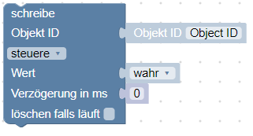

# Inhalt

* [Beschreibung](#beschreibung)
* [Editorfenster](#editorfenster)
* [Blöcke im einzelnen](#blöcke-im-einzelnen)
	* [System](#system)

        

		

		

		

		

		

		

		

		

		

		

		

		

	* [Aktionen](#aktionen)

		

		

	* [SendTo](#sendto)

		

		

		

		

		

	* [Datum und Zeit](#datum-und-zeit)

		

		

		

		

	* [Konvertierung](#konvertierung)

		[

		[

		[![Nach String konvertieren]

		[![Get type of variable]

		[

		[

		[

		[

	* [Trigger](#trigger)

		

		

		

		

		

		

		

		

		

	* [Timeouts](#timeouts)

		

		

		

		

	* [Logik](#logik)

		

		

		

		

		

		

		

	* [Schleifen](#schleifen)

		

		

		

		[![For each]

		

	* [Mathematik](#mathematik)

		

		

		

		

		

		

		

		

		[![Runden mit angabe der Nachkommastelle]

		[![Wert aus Liste berechnen]

		[![Rest nach Division (Modulus)]

		

		

		

	* [Text](#text)

		

		

		

		

		

		

		

		

		

		

		

	*  [Listen](#listen)

		

		

		

		

		

		

		

        

		

		

		[![Liste sortieren]

	* [Farbe](#farbe)

		

		

		

		

	* [Variablen](#variablen)

		

		

		

	* [Funktionen](#funktionen)

		

		

		

		

		

		

* [Beispiele](#beispiele)

	* [1.](#beispiel-1)
	* [2.](#beispiel-2)
	* [3.](#beispiel-3)

# Beschreibung
Blockly ist ein Editor im javascript-Adapter, der es erlaubt, Skripte durch
zusammenfügen von grafisch verzahnten Blöcken zu erstellen.
Die grafische Darstellung ermöglicht auch Nutzern mit wenig Kenntnis einer
Programmiersprache entsprechende Skripte einfach zu erstellen.

## Editorfenster
Aufruf des Editors erfolgt im Admin Fenster Links unter Skripte.
> Falls Skripte nicht sichtbar ist und der javascript-Adapter aber installiert
ist, muss über das Dreieck oben links im Admin Fenster der Haken bei
Skripte gesetzt werden.

Beim ersten Start sind die Ordner *global* und *common* bereits angelegt.

> Der Ordner *global* ist nur für Scripte aus reinem Javascript vorgesehen.
Mit Blockly erstellte Scripte dürfen dort auf __keinen__ Fall abgespeichert
und gestartet werden.

Die Ordnerstruktur kann nach eigenem Wunsch angelegt werden. Der Speicher-
ort hat keine Auswirkungen auf die Funktionalität eines Skriptes.

Ein Suchfeld erleichtert das Wiederfinden von Skripten.

Damit ein Skript läuft, muss es links in der Ordnerstruktur durch klick auf den
roten Play-Knopf aktiviert werden. Zum Stoppen auf den grünen Pause-Knopf
drücken.
Für jedes Skript wird ein neues Objekt angelegt. Es trägt den Skriptnamen mit
dem Zusatz `_enabled` und liegt im Ordner `javascript.0.ScriptEnabled`.
Das Objekt zeigt mit `true/false` an, ob das Skript läuft. Der Zustand kann auch
gesetzt werden, um ein Skript ein-/auszuschalten.
Im Fenster links ist die Symbolleiste und die Ordner- und Dateileiste zu finden.
Rechts das Editor Fenster mit Block-Sidebar und Arbeitsfläche und unten das
Log-Fenster.

Gewünschte Blöcke werden über die verschiedenen [Kategorien](#verfügbare-blöcke) ausgewählt und
per Drag and Drop auf der Arbeitsfläche abgelegt.

Werte oder Inhalte der Blöcke werden über Dropdown Menü oder über Maus
Linksklick geändert.

Mit Maus Rechtsklick über einem Block im Entwurfsfenster werden zusätzliche
Befehle verfügbar:

Baustein zusammenfalten: um eine bessere Übersicht zu erhalten können Bausteine,
zusammengefaltet werden.

## Blöcke im einzelnen
Blöcke sind in folgenden Kategorien unterteilt:
* [System](#system)
* [Aktionen](#aktionen)
* [Sendto](#sendto)
* [Datum und Zeit](#datum-und-zeit)
* [Konvertrierung](#konvertierung)
* [Trigger](#trigger)
* [Timeouts](#timeouts)
* [Logik](#logik)
* [Schleifen](#schleifen)
* [Mathematik](#mathematik)
* [Text](#text)
* [Listen](#listen)
* [Farbe](#farbe)
* [Variablen](#variablen)
* [Funktionen](#funktionen)

## System

### Debug

Schreibt den frei wählbaren Text, hier `test` ins log und dient zum debuggen
eines Scripts wie dies:

Dieses Beispiel zum importieren: 

Man kann 4 verschiedene Level für die Nachrichten definieren:

* debug - dazu muss der debug-Level der Javascript Instanz aktiviert sein.
* info - default, zumindest der info log level muss in der Javascript Instanz
	aktiviert sein.
* warning
* error - wird immer angezeigt. Die anderen Level können ignoriert werden, wenn
	es entsprechend in  der Javascript Instanz eingestellt ist.

### Kommentar

Ohne weitere Funktion dient dieser Block ausschließlich dazu einen Kommentar für
Erklärungen einzelner Funktionen o.ä. zum Skript hinzuzufügen.

> Pro Kommentar sind max. 48 Zeichen einzeilig sichtbar. Für längere Texte mehrere
> Kommentar Blöcke verwenden und Text aufteilen

### Steuere Zustand

Steuert den Zustand eines Objektes mit dem gewünschten Status

Typische Anwendung dieses Blocks:

Die Object ID wird durch Klick ausgewählt. Abhängig vom Typ des Datenpunkts kann
der Wert vom Typ [string](#string-value), [number](#number-value) oder [boolean](#ogical-value-trueflase) sein.

Weitere Erklärungen sind [hier](https://github.com/ioBroker/ioBroker/wiki/Adapter-Development-Documentation#commands-and-statuses) in Englisch zu finden.

Dieser Block schreibt den Befehl in den Datenpunkt mit (ack=false). Zusätzlich
kann eine Verzögerung angegeben werden. Wenn die Verzögerung ungleich 0
ist, wird der Zustand nicht sofort, sondern erst nach dem angegebenen Wert in
Millisekunden, Sekunden oder Minuten gesetzt.

Man kann weitere eventuell vorhandene Verzögerungen für diesen Datenpunkt
löschen, indem man die Checkbox `löschen falls läuft` anklickt.

Im folgenden Beispiel wird der Datenpunkt `Licht` nur einmal nach 2 Sekunden
geschaltet:

Dieses Beispiel zum importieren: 

Hier wird der Zustand von `Licht` zwei mal nach 1 Sekunde __und__ nach 2 Sekunden
geschaltet:

Dieses Beispiel zum importieren: 

### Zustand umschalten

Dieser Block schaltet zwischen den Werten um, non true nach false und umgekehrt.

### Aktualisiere Zustand

Dieser Block aktualisiert einen Wert. Es wird kein Befehl zum steuern von Hardware
gesendet.

Typische Anwendung dieses Blocks:

### Binde zwei Zustände

Dieser Block bindet zwei Zustände miteinander. Über `nur Änderungen` kann ausgewählt
werden, ob der Wert nur weitergeleitet wird, wenn sich die Quelle ändert, oder
mit jeder Aktualisierung.

Diese Blöcke:

Dieses Beispiel zum importieren: 

entsprechend mit dem Binde Block:

### Schreibe Zustand

Block, der [Aktualisiere Zustand](#aktualisiere-zustand) und [Steuere Zustand](#steuere-zustand) zusammen ausführt.
Object ID und Verzögerung mit anderen Bausteinen kann aber definiert werden.

### Datenpunkt erzeugen

Zwei Arten von Variablen können in Skripten erzeugt werden:

- locale [variablen](#set-variables-value)
- globale variablen oder Zustände (states).

Global Zustände sind in allen Skripten sichtbar, Lokale hingegen nur im
aktuellen Skript.

Global Zustände können in vis und allen anderen Visualisierungsmodulen
genutzt werden und können in eine DB geloggt werden.

Dieser Block erzeugt globale Zustände und wenn dieser bereits existiert wird der
Befehl ignoriert. Daher kann dieser Block ohne Risiko zu jedem Skriptstart
verwendet werden.

Typische Anwendung dieses Blocks:

Dieses Beispiel zum importieren: 

Man kann den neu erzeugten State bereits in dem Block selber nutzen.

Bei der ersten Ausführung dieses Blocklys wird ein Fehler ausgegeben, da der Datenpunkt erst nach der Ausführung zu finden ist.
Bei der zweiten Ausführung wird kein Fehler mehr ausgegeben, weil der Datenpunkt jetzt existiert.

### Wert eines Datenpunktes 1

Dieser Block dient dazu den Wert eines Datenpunktes auszulesen. Folgende Attribute des Datenpunktes können ausgelesen werden:
- Wert
- Acknowledge - Befehl = falsch oder update = wahr
- Timestamp in ms seit dem 01.01.1970 (Hat den Typ "Datumsobjekt")
- Letzte Änderung des Wertes in ms seit dem 01.01.1970 (Hat den Typ "Datumsobjekt")
- Qualität
- Quelle - Name der Instanz, die den letzten Wert geschrieben hat, wie z.B. "system.adapter.javascript.0"

Beispiel um die Zeit der letzten Änderung des Wertes auszugeben:

Dieses Beispiel zum importieren: 

### Wert eines Datenpunktes 2

Beschreibung fehlt noch!

### Wert eines Datenpunktes 3

Beschreibung fehlt noch!

### Objekt ID

Dieses ist ein einfacher Hilfsblock um komfortabel die Objekt ID zum triggern des Blocks auszuwählen.
Der ID Auswahldialog wird durch Anklicken von "Objekt ID" geöffnet.

Typische Anwendung dieses Blocks:

Dieses Beispiel zum importieren: 

### Attribut

Beschreibung fehlt noch!

## Aktionen

### Exec-Kommando

Dieser Block führt das eingegebene Kommando im System aus, so als ob man es in
der SSH Konsole eingegeben hätte.
Der Befehl wird mit den rechten des Users ausgeführt unter dem ioBroker gestartet
wurde.

Wenn keine Ausgabe gewünscht ist, kann diese unterdrückt werden:

Wenn eine Ausgabe erfolgen soll:

Dieses Beispiel zum importieren: 

Zur Anlayse der Ausgabe werden 3 besondere Variablen erzeugt:

* Ergebnis, enthält die reguläre Ausgabe auf die Konsole (z.B für den Befehl
    "ls /opt" lautet die Ausgabe "iobroker nodejs")
* Fehlerobjekt, wenn der Befehl vom JavaScript Modul nicht ausgeführt werden konnte
* stderr, die Fehlerausgabe des ausgeführten Programms

Zusätzlich wird die selbe Ausgabe auch im log erscheinen, wenn der loglevel
nicht auf 'none' steht.

### request URL

Ruft eine URL auf und gibt das Ergebnis zurück.

Beispiel:

Zur Anlayse der Ausgabe werden 3 besondere Variable erzeugt:

* Ergebnis, enthält den body der angeforderten Seite
* Fehler, enthält eine Fehlerbeschreibung
* Antwort (nur für Fortgeschrittene), Spezialobjekt vom Typ [http.IncomingMessage](https://nodejs.org/api/http.html#http_class_http_incomingmessage)

Wenn keine Ausgabe gewünscht ist, kann diese unterdrückt werden. Dazu die Option
"mit Ergebnis" abhaken.

to be continued...

